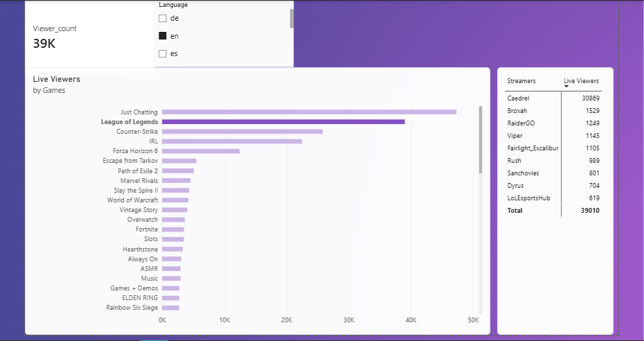

# Twitch Live Streaming Analytics Dashboard

## Overview
An interactive Power BI dashboard tracking live viewership metrics, top games, streamer statistics, and language distributions on Twitch.

## Visual Preview

## Key Features
* **Total Viewership**: Real-time count of total live viewers.
* **Top Games by Viewers**: Visual breakdown of live viewership across games like *League of Legends*, *Just Chatting*, and *Counter-Strike*.
* **Streamer Breakdown**: Detailed streamer leaderboards with live viewer counts.
* **Slicer Filters**: Language slicers (`en`, `de`, `es`, `fr`, etc.) and game filters.

## Data Model
* `dim_games`: Game dimensions
* `dim_streamers`: Streamer profiles
* `fact_stream_metrics`: Live stream engagement metrics

## How to View
1. Download `Twitch_Dashboard.pbix` from this repository.
2. Open the file using [Power BI Desktop](https://powerbi.microsoft.com/desktop/).
